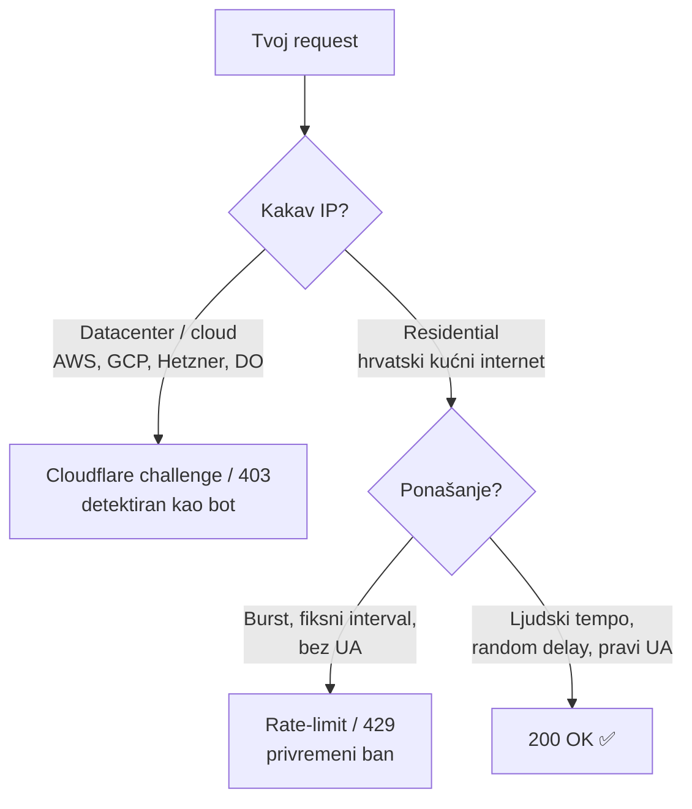
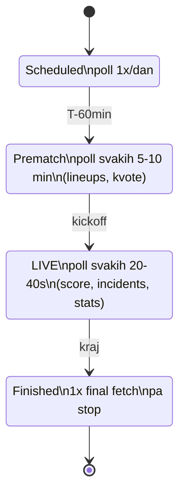

# 03 — Fetching strategy (blokiranje, delay, retry, cache)

SofaScore = **jedini izvor istine** za stvarne podatke. Da bi ostao izvor istine cijeli mjesec,
mora se dohvaćati **pametno i stabilno**. Ovaj dokument je pravilnik za svaki request.

## 1. Model blokiranja — najvažnije za arhitekturu

Blokira se po **tipu IP adrese**, ne po zemlji:



**Posljedica #1 — fizička podjela:** komponenta koja zove SofaScore (**fetcher**) mora raditi
s **residential IP-a** (tvoj kućni stroj / mini PC / Raspberry Pi kod kuće). Komponenta koja
je "online mjesec dana" za korisnike (**API + frontend + AI predictor**) može biti u cloudu —
ali ona **nikad ne zove SofaScore direktno**, nego čita iz **naše baze** koju fetcher puni.

```mermaid
flowchart LR
    SS[(SofaScore API)]
    subgraph home [🏠 Residential IP - kod kuće]
        F[Fetcher / Ingest worker]
    end
    subgraph cloud [☁️ Cloud - javno, 24/7]
        DB[(Naša baza<br/>source of truth)]
        API[Backend API]
        FE[Frontend]
        AI[AI Predictor]
    end
    SS -->|smart polling| F
    F -->|upsert| DB
    DB --> API --> FE
    DB --> AI --> API
    style home fill:#1e3a2f
    style cloud fill:#1e2a4a
```



Veza fetcher → baza: fetcher push-a u cloud bazu (npr. managed Postgres / Supabase /
Cloudflare D1 preko autenticiranog endpointa), ili baza živi kod kuće a tunelira se van
(Cloudflare Tunnel). Vidi [04](./04-target-architecture.md).

## 2. Pravila za svaki request

| Pravilo | Vrijednost |
|---------|-----------|
| **Random delay** između requestova | `base + jitter`, npr. `rand(1500ms, 4000ms)` |
| **Realan User-Agent** | rotiraj iz liste pravih browser UA stringova |
| **Headers** | `Accept: application/json`, `Referer: https://www.sofascore.com/` |
| **Concurrency** | 1 (serijski). Nikad burst. |
| **Retry** | eksponencijalni backoff + jitter, max 3–4 pokušaja |
| **Honor 429/`Retry-After`** | pauziraj koliko traži, pa nastavi |
| **Circuit breaker** | nakon N uzastopnih 403/429 → stani 10–30 min |
| **Cache / conditional** | poštuj `ETag`/`Last-Modified`; ne traži isto dvaput bez razloga |

### Delay s jitterom (referentni pseudokod)

```ts
const sleep = (ms: number) => new Promise(r => setTimeout(r, ms));
const jitter = (min: number, max: number) => min + Math.random() * (max - min);

async function polite<T>(fn: () => Promise<T>, attempt = 0): Promise<T> {
  try {
    await sleep(jitter(1500, 4000));          // ljudski razmak prije svakog poziva
    return await fn();
  } catch (e: any) {
    const status = e?.response?.status;
    if ((status === 429 || status === 403) && attempt < 3) {
      const backoff = jitter(2000, 5000) * 2 ** attempt;  // 2s,4s,8s… + jitter
      await sleep(backoff);
      return polite(fn, attempt + 1);
    }
    throw e;
  }
}
```

## 3. Polling kadenca po fazi utakmice

Ne pollaj sve jednako. Prilagodi učestalost stanju:



- **Backfill povijesti** (sve odigrane utakmice svih reprezentacija): jednokratno, sporo,
  može trajati satima — pusti preko noći s velikim delayom.
- **Live faza:** scheduler bira samo utakmice u tijeku i pollat ih ~svakih 30s (s jitterom).
- Koristi `/sport/football/events/live` da nađeš žive, pa per-event detalje.

## 4. Idempotencija i "raw + parsed"

- Spremaj **sirovi JSON** odgovora (kao stari repo) **i** normalizirani zapis. Ako kasnije
  promijeniš parsing, re-procesiraš iz raw-a bez ponovnog hitanja API-ja.
- Svi upserti po `ss_id` (event id, team id) → ponovni fetch ne duplicira.
- Logiraj svaki fetch (url, status, trajanje) za debug i za dokaz da poštuješ rate-limit.

## 5. Pravni / etički guardrails

- Neslužbeni API, scraping nije izrijekom dozvoljen. Drži **nizak volumen**, **bez paralelizma**,
  **bez preprodaje sirovih podataka**. Ovo je osobni/edukacijski projekt.
- Imaj fallback: ako SofaScore padne ili promijeni shape, sustav degradira graciozno
  (zadnji poznati podatak iz baze), ne ruši se.
