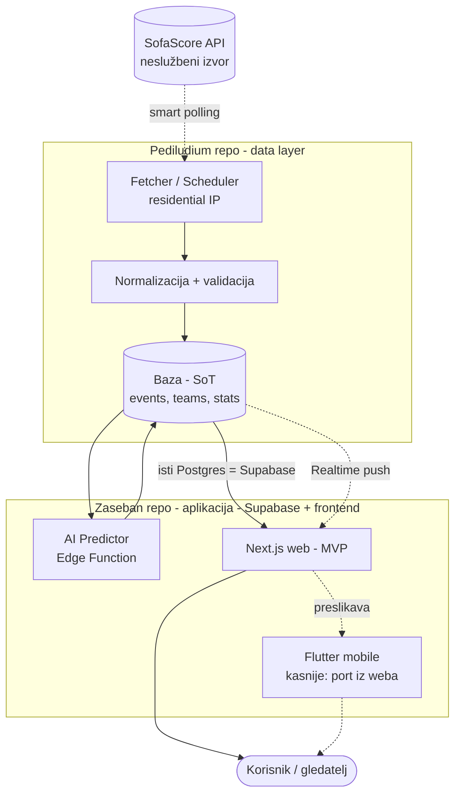
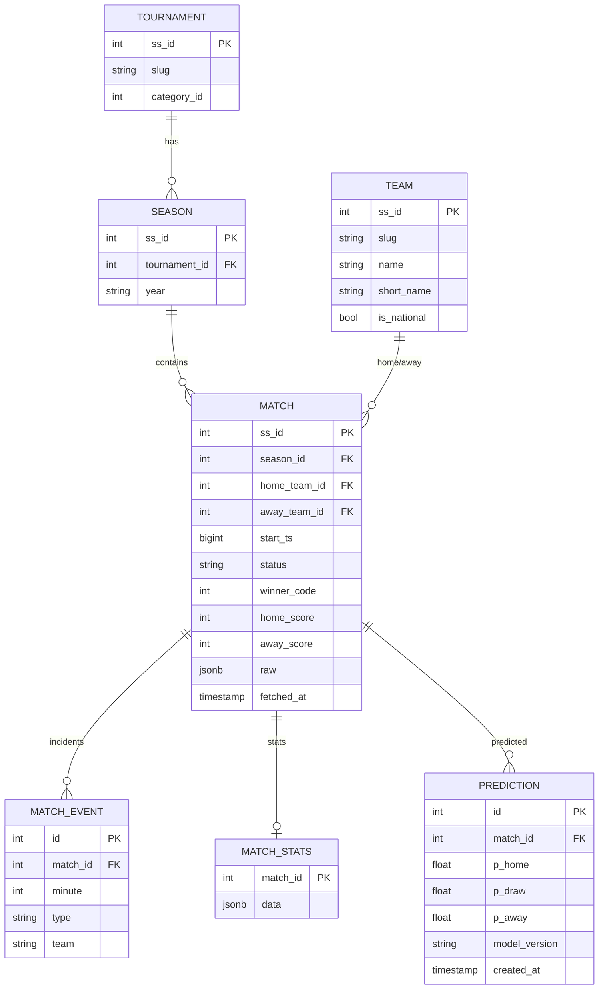
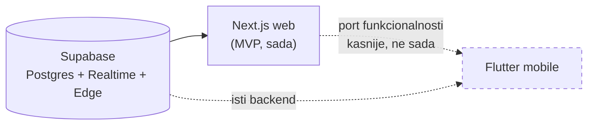
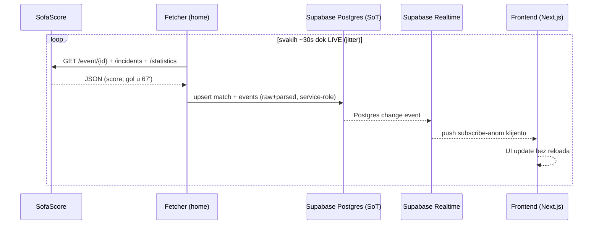

# 04 — Ciljana arhitektura

> **Podjela repozitorija (dogovoreno):**
> - **`Pediludium` (ovaj repo)** = *single source of truth dokumentacija* za SofaScore podatke
>   + (opcionalno) **fetcher/ingest** koji puni bazu. Ovo je "data layer".
> - **Zaseban repo** = **aplikacija** (Supabase + Next.js web, kasnije Flutter mobile) za naš
>   konkretan use case (praćenje SP-a). Čita **samo iz naše baze**, nikad direktno SofaScore.

> **Tech stack (dogovoreno):**
> - **Baza + backend:** **Supabase** (managed **PostgreSQL** + Auth + auto REST/GraphQL + **Realtime**).
> - **Lokalni razvoj:** Supabase u **Dockeru lokalno** (`supabase start`) — sve se testira offline prije clouda.
> - **Web (MVP, prvo):** **Next.js / React**.
> - **Mobile (kasnije):** **Flutter**, ali kao **port funkcionalnosti iz Next.jsa** — u planu je,
>   **ne implementira se sada**. Web je referentna implementacija; Flutter ga preslikava.
>
> **Povijesna napomena:** u starom repou perzistencija je išla samo u CSV/JSON (nema DB koda).
> Firestore koji se spominje bio je u ranijem/drugom projektu. Dakle DB sloj je *greenfield* →
> idemo na Supabase/Postgres jer se lokalno vrti u Dockeru i nudi Realtime out-of-the-box.

## C4-ish kontekst

> `db` u dijagramu **je** Supabase Postgres. Fetcher piše u njega (service-role key), web čita
> iz njega (anon key + RLS) i sluša promjene preko **Supabase Realtime** — bez vlastitog WS servera.

**Zlatno pravilo:** strelica `SofaScore -.-> fetcher` postoji **samo jednom** u cijelom
sustavu. Sve ostalo čita iz `db`. Time je baza jedini izvor istine i jedina stvar koju
frontend/AI vide.

## Komponente

### A) Fetcher / Ingest (residential, ovaj repo)
- **Scheduler** koji bira što i kada pollat (vidi state-diagram u [03](./03-fetching-strategy.md)).
- **Politeness layer** (delay, jitter, retry, circuit breaker, UA rotacija).
- **Normalizer**: raw JSON → naš shema; sprema **i raw i parsed**.
- **Writer**: upsert po `ss_id` u bazu.
- Pokreće se kod kuće (mini PC / Pi / vlastiti laptop). Otpornost na restart: zna gdje je stao.

### B) Baza — source of truth → **Supabase / PostgreSQL**
- **Supabase** = hostani PostgreSQL + Auth + auto-generirani REST/GraphQL + **Realtime** + Edge Functions.
- **Lokalno prvo (Docker):** `supabase start` digne cijeli stack u Dockeru → migracije, RLS i
  Realtime testiraš offline, bez ijednog poziva u cloud. Tek kad radi → `supabase db push` na hosted.
- Fetcher piše **service-role** ključem; frontend čita **anon** ključem uz **RLS** politike.
- `jsonb raw` kolona čuva sirovi SofaScore odgovor; normalizirane kolone za upite.

Minimalna shema:

### C) Backend → **Supabase** (zaseban repo, cloud; lokalno Docker)
- Supabase **sam je backend**: Postgres + auto REST/GraphQL + Auth + Realtime. Minimalno vlastitog
  servera. Custom logika ide u **Edge Functions** (Deno/TS) — npr. trigger predikcije, agregacije.
- Frontend čita direktno preko **Supabase JS klijenta** (anon key + **RLS**), bez ručno pisanog API-ja.
- **Realtime bez vlastitog WS servera:** frontend se `subscribe`-a na promjene tablica (Postgres
  changes / broadcast). Kad fetcher upsert-a live score, Supabase Realtime gura update u UI.

### D) AI Predictor (zaseban repo)
- **Baseline prvo** (radi za 4 dana): Poisson / Dixon-Coles model golova iz povijesnih
  rezultata + Elo/SPI rating reprezentacija. Daje `p_home / p_draw / p_away` i očekivane golove.
- **Upgrade kasnije:** gradient boosting (xG, forma, odmor, snaga rivala) ili LLM-asistirani
  scenariji. Verzioniraj model (`model_version`) i spremaj predikcije **prije** utakmice
  (inače curi rezultat).
- Trenira se iz baze (povijest svih reprezentacija), servira kao **Supabase Edge Function** ili
  Next.js API route; rezultat upisuje u `prediction` tablicu pa ga frontend čita kao i sve ostalo.

### E) Frontend / platform strategija (web → mobile)
- **Web je MVP i referentna implementacija.** Sva funkcionalnost se prvo posloži u **Next.js / React**.
- **Flutter (mobile) je u planu, ali se NE radi sada.** Kad web bude funkcionalno potpun, Flutter ga
  **preslikava** (port) — iste Supabase tablice, isti Realtime, ista predikcijska logika preko istog
  backenda. Zato je važno da web bude čist i da je sva domena u bazi/Edge funkcijama (ne u UI-ju),
  da Flutter samo gradi novi UI nad istim podacima.

## Tok podataka: realtime utakmica

> `DB`, `Supabase Realtime` i auto-API su **jedan te isti Supabase**; fetcher samo upsert-a,
> sve ostalo Supabase odradi sam.

## Preporučeni tech izbori (industry best practice)

| Sloj | Izbor (dogovoreno) | Zašto |
|------|-----------|-------|
| Jezik | **TypeScript** svuda | tipovi za API shape, jedan jezik FE+fetcher+Edge |
| Fetcher | Node + `undici`/`axios`, `zod` za validaciju | runtime validacija raw odgovora |
| Baza + backend | **Supabase / PostgreSQL** | Postgres + Auth + auto-API + Realtime, lokalno u Dockeru |
| Lokalni dev | **Supabase CLI + Docker** (`supabase start`) | cijeli stack offline prije clouda |
| Migracije | Supabase migrations (SQL) / Drizzle | verzionirana shema |
| Realtime | **Supabase Realtime** (Postgres changes) | bez vlastitog WS servera, klijent se `subscribe`-a |
| Web (MVP) | **Next.js / React** | referentna implementacija, brz realtime UI |
| Mobile (kasnije) | **Flutter** — port iz weba, *ne sada* | isti Supabase backend, samo novi UI |
| Config | `.env` + zod-parsed config | bez hardkodiranih id-eva/limita |
| Kvaliteta | ESLint + Prettier + Vitest + CI | regresije se hvataju rano |
| Secrets | nikad u repo; `.env` je već u `.gitignore` | service-role ključ samo u fetcheru |

> Za 4 dana realno: lokalni Supabase (Docker) + fetcher (TS+zod+politeness) + Next.js web +
> Poisson/Elo baseline. Flutter ostaje isključivo u planu, ne u kodu.
