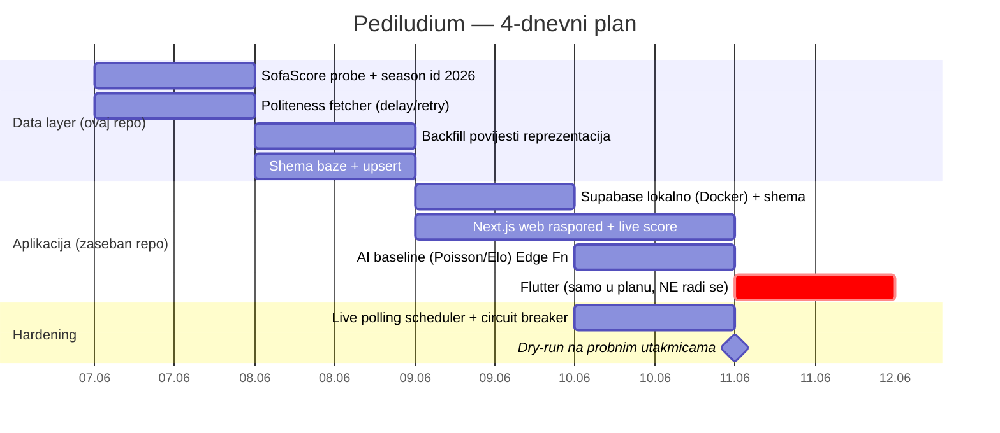
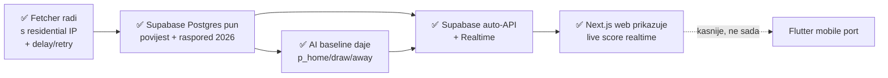

# 05 — Roadmap do starta turnira

Danas **2026-06-07**, start ~**2026-06-11**. 4 dana. Princip: **MVP-first** — prvo pouzdan
podatak u bazi, tek onda ljepota i AI. Bolje raditi s 100% stvarnih podataka i grubim
modelom, nego s lijepim UI-em bez podataka.

## Dan po dan

### Dan 1 (07.06) — Dokaz da podaci teku
- [ ] Probaj endpointe iz [02](./02-sofascore-api-reference.md) s **residential IP-a**.
      Potvrdi 200 i shape (snimi po 1 sample JSON za svaki).
- [ ] Nađi **World Cup 2026 season id**: `GET /unique-tournament/16/seasons` → year `2026`.
- [ ] Iz `…/season/{sid}/events/next/0` izvuci 48 reprezentacija (team id-evi).
- [ ] Napiši **politeness layer** (delay+jitter+retry) — srce svega (vidi [03](./03-fetching-strategy.md)).

### Dan 2 (08.06) — Backfill + baza
- [ ] Za svaku reprezentaciju: `team/{id}/events/last/{page}` dok `hasNextPage` → povijest.
      Pusti preko noći, velik delay.
- [ ] Shema baze ([04](./04-target-architecture.md)) + upsert po `ss_id`, spremaj raw+parsed.
- [ ] Sanity: koliko utakmica po reprezentaciji, ima li rupa.

### Dan 3 (09.06) — Aplikacija (zaseban repo)
- [ ] `supabase start` lokalno (Docker), migracije za shemu iz [04](./04-target-architecture.md), RLS politike.
- [ ] Scaffold **Next.js** weba: Supabase JS klijent, stranice raspored + tablica grupa.
- [ ] Realtime: frontend `subscribe` na `match` promjene — za sad prazna cijev, sutra spoj na live ingest.
- [ ] **Flutter se NE radi** — samo potvrdi u planu da web ostaje čist za kasniji port.

### Dan 4 (10.06) — Live + AI baseline + proba
- [ ] Live scheduler: nađi žive (`/sport/football/events/live`), pollaj ~30s, push na FE.
- [ ] AI baseline (Poisson/Dixon-Coles + Elo) → `prediction` zapisi prije utakmica.
- [ ] **Dry-run** na bilo kojoj utakmici koja se igra 10.–11. (prijateljske/druge lige) da
      potvrdiš da live pipeline radi prije otvaranja SP-a.

## Definicija gotovog MVP-a (pred start)

## Rizici i mitigacije

| Rizik | Mitigacija |
|-------|-----------|
| SofaScore promijeni/blokira endpoint | raw spremljen → re-parse; circuit breaker; degradiraj na zadnji poznati |
| Kućni IP ipak dobije rate-limit | veći delay, manje endpointa, noćni backfill |
| Fetcher kod kuće padne (struja/net) | resumable scheduler; health-ping; auto-restart (pm2/systemd) |
| Nema vremena za pravi AI model | Poisson/Elo baseline je dovoljno dobar i pošten start |
| Curenje rezultata u predikciju | spremaj predikciju **prije** kickoffa, s `model_version` |

## Sljedeći korak

Kad potvrdiš ovaj plan, mogu:
1. Scaffold-ati **fetcher** u ovom repou (TS + zod + politeness layer; piše u Supabase), ili
2. Napraviti `00-probe` skriptu koja samo verificira endpointe i dohvati season id 2026, ili
3. Otvoriti zaseban repo s lokalnim **Supabase (Docker)** + **Next.js** scaffoldom.

Reci čime krećemo. (Flutter ostaje u planu, ne implementiramo ga u ovoj fazi.)
