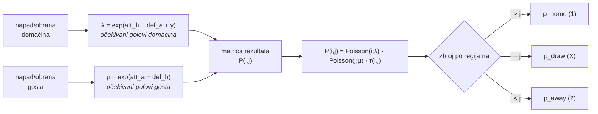
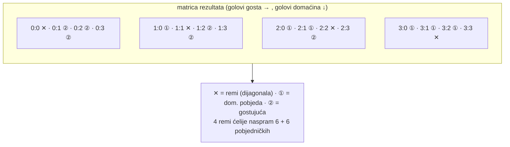
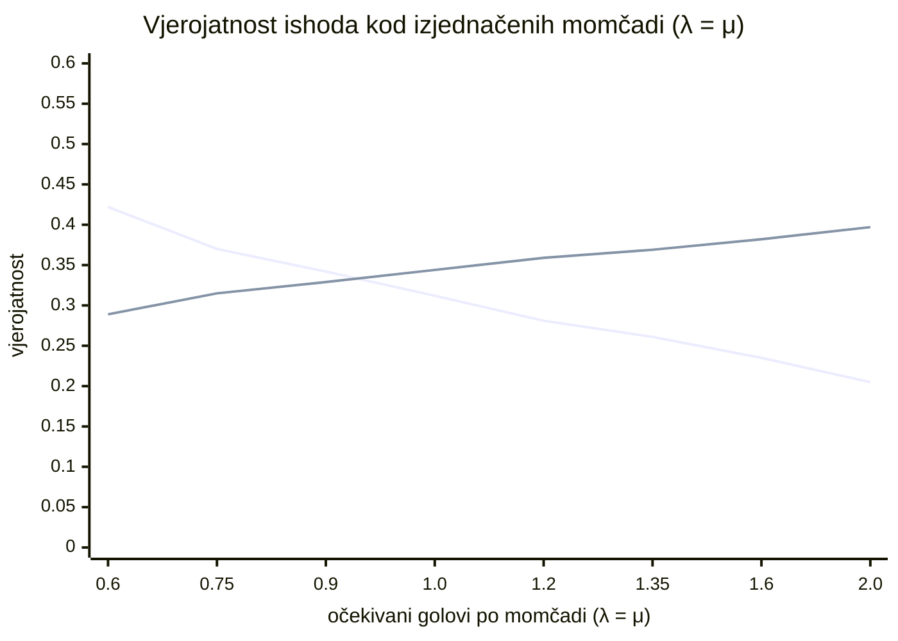
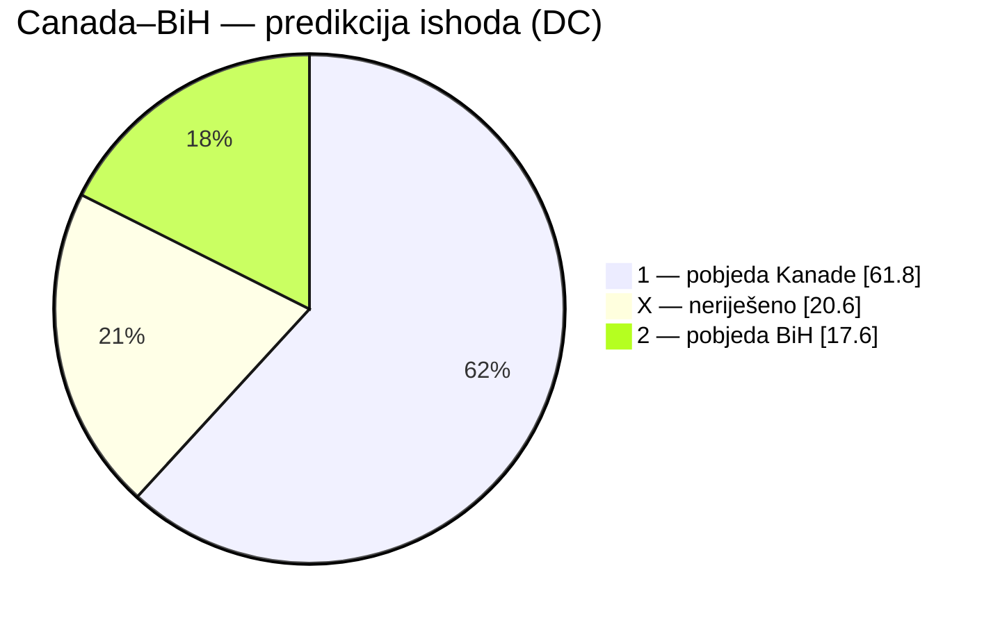

# 17 — Paradoks neriješenog: zašto nijedna predikcija nije remi

> **Izvor za prvi tehnički blog post** (`/blog/zasto-nijedna-predikcija-nije-remi`).
> Pitanje koje je pokrenuo korisnik: *pogledao sam sve predikcije za sve utakmice i niti
> jedna nema predikciju za neriješeno — to mi djeluje nerealno, zašto?*

Kratak odgovor: **nije nerealno, nego matematički neizbježno.** Naš Dixon-Coles model
nikad ne *bira* remi kao najvjerojatniji ishod — ne zato što misli da je remi nemoguć
(daje mu realnih ~20–30 %), nego zato što način na koji se ishod sastavlja iz distribucije
rezultata strukturno favorizira pobjede. Ovaj dokument to izvodi iz prve linije koda.

---

## 1. Što model zapravo računa

Model ne predviđa "pobjednika". Predviđa **distribuciju po svim mogućim rezultatima**, pa
tek iz nje zbraja vjerojatnost tri ishoda. Lanac izračuna:



`λ` i `μ` su očekivani golovi svake momčadi (`model.ts → rates()`). Iz njih se gradi
**matrica rezultata** `P(i, j)` = vjerojatnost da domaćin zabije `i`, gost `j`
(`dcScoreMatrix()`), gdje je svaka ćelija umnožak dviju Poissonovih razdioba uz
Dixon-Coles korekciju `τ` za niske rezultate.

Ishod je onda samo zbroj ćelija (`outcomeProbs()`):

| Ishod | Ćelije matrice | Geometrija |
|-------|----------------|------------|
| **1** — pobjeda domaćina | `i > j` | cijeli trokut **ispod** dijagonale |
| **X** — neriješeno | `i = j` | samo **dijagonala** (0:0, 1:1, 2:2, …) |
| **2** — pobjeda gosta | `i < j` | cijeli trokut **iznad** dijagonale |

Tu je cijela poanta: **remi je jedna tanka linija, pobjede su dvije pune polovice.**

---

## 2. Geometrija: zašto dijagonala uvijek gubi

Matrica je 11×11 (rezultati 0–10 po momčadi). Remi živi na 11 ćelija na dijagonali;
pobjede dijele preostalih 110 ćelija. Čak i kad su momčadi savršeno izjednačene
(`λ = μ`), masa vjerojatnosti razlije se po objema trokutima, a dijagonala pokupi samo
ono što "pogodi" istu brojku s obje strane.



Da bi remi postao *najvjerojatniji* ishod, dijagonala mora pokupiti više od ⅓ ukupne
mase. To se događa **samo kod ekstremno niskoskorirajućih utakmica** — kad oba očekivana
gola padnu ispod ~0.9. Iznad toga jedan od dva trokuta gotovo uvijek prijeđe dijagonalu.

Egzaktan presjek (uz fitani `ρ = −0.012`), skeniran u `model.ts`:



Linije se sijeku oko **λ = μ ≈ 0.89**. Lijevo od presjeka (utakmice s vrlo malo golova)
remi vodi; desno — gdje živi praktički sav reprezentativni nogomet (prosjek našeg modela
je **1.35 gola po momčadi**) — remi je trajno treći. Pri ligaškom prosjeku savršeno
izjednačena utakmica daje **0.369 / 0.261 / 0.369**: remi gubi od *obje* strane istovremeno.

---

## 3. Dixon-Coles `τ` korekcija postoji baš zbog ovoga

Čisti, nezavisni Poisson podcjenjuje niske remije (0:0, 1:1). Dixon & Coles (1997) zato
dodaju korekciju `τ` koja spaja četiri najniže ćelije i diže im vjerojatnost
(`model.ts → tau()`):

```
τ(0,0) = 1 − λμρ      τ(0,1) = 1 + λρ
τ(1,0) = 1 + μρ       τ(1,1) = 1 − ρ
```

Uz tipično `ρ < 0`, faktor `(1 − ρ)` na ćeliji 1:1 **podiže** vjerojatnost najčešćeg
remija. Efekt je mjerljiv: u našoj bazi prosječni `p_draw` Dixon-Colesa je **0.280** vs.
**0.255** kod nezavisnog-Poisson baseline-a. Korekcija radi točno ono za što je dizajnirana
— ali ni ona ne digne remi na vrh, jer pomiče jednu ćeliju, a ne cijelu geometriju.

---

## 4. Dokaz iz baze: 104 utakmice, 0 favoriziranih remija

Agregat svih predikcija u trenutku pisanja:

| Model | n | remi je favorit | max `p_draw` | prosj. `p_draw` |
|-------|---|-----------------|--------------|------------------|
| `dixon-coles-v1` | 104 | **0** | 0.324 | 0.280 |
| `baseline-poisson-elo-v1` | 104 | **0** | 0.256 | 0.255 |

Najizjednačenija pojedinačna utakmica u bazi ima **0.341 / 0.324 / 0.335** — remi je i tu
treći, za dlaku. To je isto ponašanje koje vidite kod kladionica: remi gotovo nikad nije
favorit, ni za najveće derbije.

### Prvi živi primjer — Canada 1:1 Bosna i Hercegovina

Prva odigrana utakmica koja je završila neriješeno. Model je za nju računao
`λ = 2.10`, `μ = 1.03` (Kanada domaćin, jači napad), što daje:



Argmax je rekao "1" (61.8 %), palo je "X" → u tablici pogodaka to je promašaj. Ali model
**nije tvrdio da je remi nemoguć** — dao mu je 20.6 %, otprilike jedan od pet. Promašaj je
artefakt gledanja samo najvjerojatnijeg ishoda, ne greška u vjerojatnostima.

---

## 5. Pouka: argmax ≠ kalibracija

Ovo je srž zašto projekt uopće postoji. "Model nikad ne pogađa remi" zvuči kao mana dok ne
shvatite da **najvjerojatniji ishod nije isto što i kalibrirana vjerojatnost**:

- **Argmax** (biramo jedan ishod) — strukturno slijep za remi, kao i kladionice.
- **Kalibracija** (gledamo vrijedi li vjerojatnost) — pravi test: ako model 100 utakmica
  proglasi remijem s ~25 % svaka, treba ih pasti ~25.

Pravi remi-postotak u grupnoj fazi SP-a povijesno je ~25–30 %. Naš model u zbroju očekuje
upravo toliko — samo nikad koncentrirano u jednoj utakmici. Prva četiri rezultata to već
nagovještavaju:

| Model | odigrano | Σ `p_draw` (očekivani remiji) | stvarni remiji |
|-------|----------|-------------------------------|-----------------|
| `dixon-coles-v1` | 4 | 0.95 | 1 |
| `baseline-poisson-elo-v1` | 4 | 0.99 | 1 |

Uzorak je premali za zaključke, ali smjer je točan: model "pogađa" remije **volumenom**, ne
pojedinačnim pozivom. Pravu provjeru — reliability dijagram (predviđeno vs. stvarno po
košarama vjerojatnosti) — uključujemo na `/accuracy` kad skupimo 20+ odigranih utakmica.

---

## Reference u kodu

| Koncept | Lokacija |
|---------|----------|
| `λ`, `μ` iz snaga momčadi | `fetcher/src/model.ts → rates()` |
| Dixon-Coles `τ` korekcija | `fetcher/src/model.ts → tau()` |
| Matrica rezultata `P(i,j)` | `fetcher/src/model.ts → dcScoreMatrix()` |
| Zbroj u 1/X/2 | `fetcher/src/model.ts → outcomeProbs()` |
| Fit (weighted MLE) | `fetcher/src/model.ts → fitDixonColes()` |
| Pisanje predikcija | `fetcher/src/dixon-coles.ts` |
| Backtesting / kalibracija | `web/app/accuracy/page.tsx` |

Vidi i: [08-prediction-roadmap](./08-prediction-roadmap.md), [13-simulation-model](./13-simulation-model.md).
