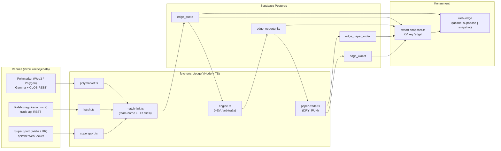
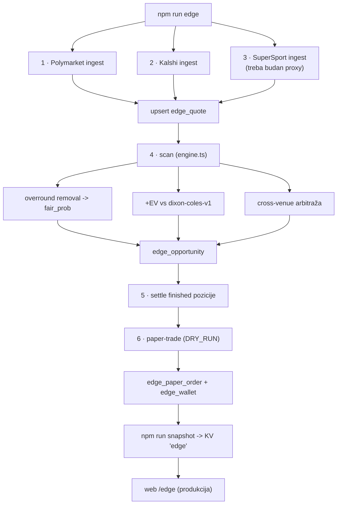
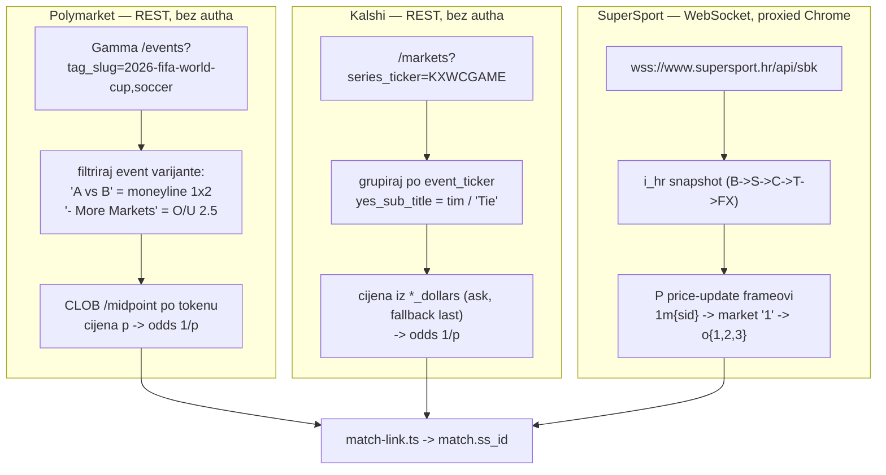
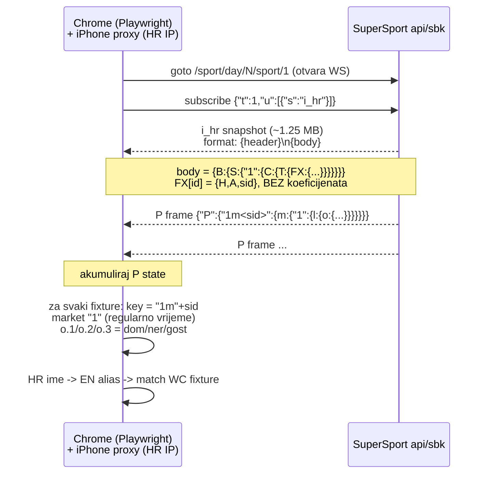
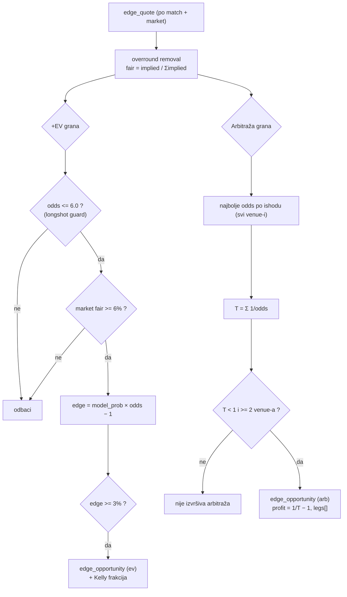
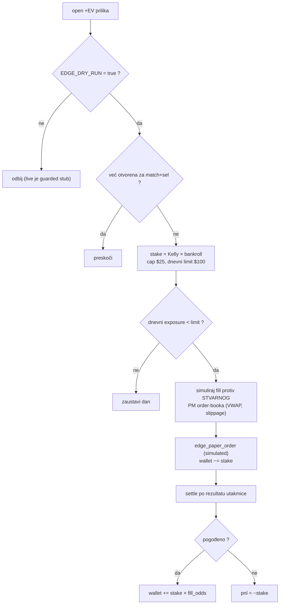
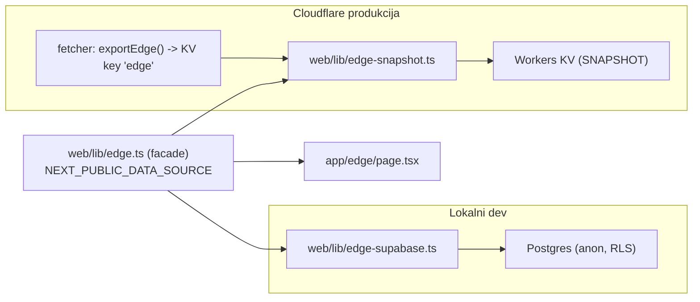
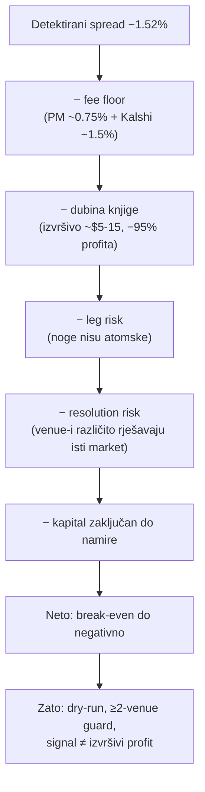
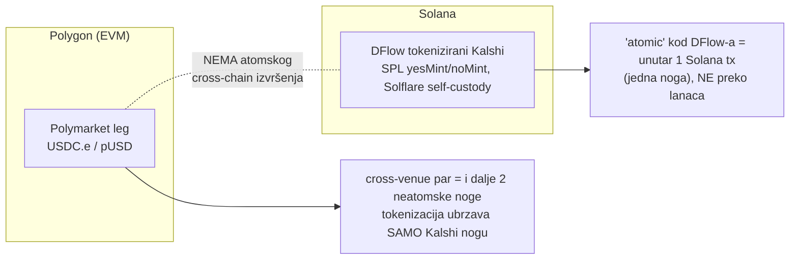

# 18 · Edge layer — vizualni vodič (Web2 ↔ Web3 odds, +EV/arbitraža, dry-run trading)

Vizualni prikaz svakog koraka edge sloja izgrađenog 2026-06-12/13. Tekstualni detalji:
`docs/16`. Memorija: `pediludium-edge-layer`. Sve dijagrame renderira Mermaid.

---

## 1. Arhitektura — gdje sve živi

---

## 2. End-to-end pipeline (npm run edge)

---

## 3. Ingest po venue-u — tri različita transporta

---

## 4. SuperSport WS protokol — reverse-engineering (najteži dio)

> Razdjelnik framea je **newline** (`\n`), ne razmak — to je bila ključna prepreka.
> Imena su hrvatska (Njemačka, Maroko…) → HR→EN alias mapa u `match-link.ts`.

---

## 5. Engine — +EV i arbitraža s guardovima

---

## 6. Dry-run trade — životni ciklus pozicije

---

## 7. Deploy — snapshot facade (dev vs produkcija)

---

## 8. „Free money"? — kuda nestane 1.52% (reality-check)

Izvori: [arXiv 2605.00864](https://arxiv.org/html/2605.00864v1) (depth haircut −95.2%),
[arXiv 2601.01706](https://arxiv.org/html/2601.01706v1) (Law of One Price),
[Polymarket fees](https://docs.polymarket.com/trading/fees),
[Kalshi fees](https://kalshi.com/docs/kalshi-fee-schedule.pdf).

---

## 9. Cross-chain atomicity — zašto „istovremeno svugdje" ne ide

> DFlow (od 1.12.2025) tokenizira Kalshi pozicije na Solani (Solflare self-custody, 1:1
> redemption, ~zero added fee) — stvarno i korisno za **Kalshi leg + custody**. Ali
> Polymarket je na Polygonu → atomska cross-venue arbitraža i dalje ne postoji.
> Atomski bi bilo moguće tek kad bi obje noge bile na istom lancu (DFlow EVM "on the way").

---

## Sažetak — što je istina, što nije

| Tvrdnja | Status |
|---|---|
| Polymarket + Kalshi koeficijenti, normalizirani, usporedivi | ✅ radi, live |
| SuperSport (Web2) koeficijenti preko WS | ✅ radi (treba budan proxy) |
| Cross-venue arbitraža detekcija (≥2 venue-a) | ✅ radi (PM↔Kalshi) |
| Dry-run trgovanje sa stvarnim order-book fillom | ✅ radi |
| Kalshi tokeniziran on-chain (DFlow/Solana/Solflare) | ✅ istina |
| Arbitraža = „free money perpetuum mobile" | ❌ tanak/negativan nakon troškova |
| Atomska arbitraža istovremeno na svim venue-ima | ❌ različiti lanci, neatomski |
| Postoji gotov „plug keys & run" bot vrijedan povjerenja | ❌ ne (pmxt je jedina ozbiljna lib) |

**Single point of truth ostaje ovaj codebase.** Sljedeći smisleni koraci: DFlow API kao
Kalshi quote/execution izvor (bolje od tankog `last_price`), ostali HR bookovi (svaki je
zaseban WS), DC kalibracija prije nego se +EV uzme zaozbiljno.
