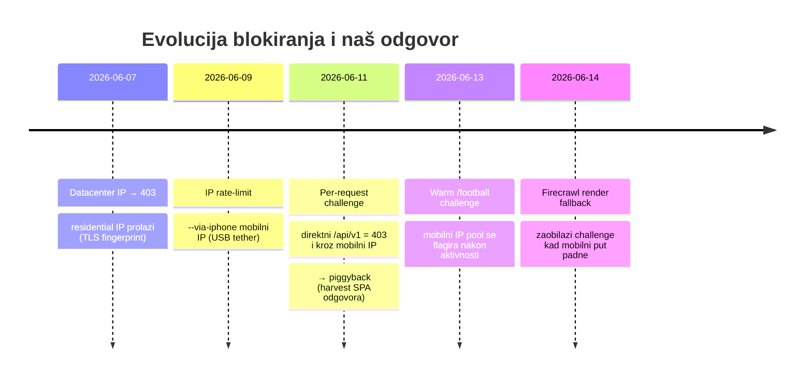
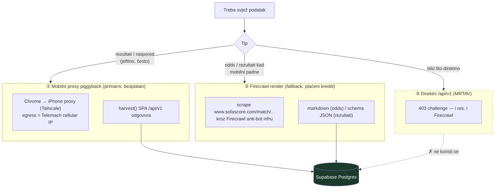
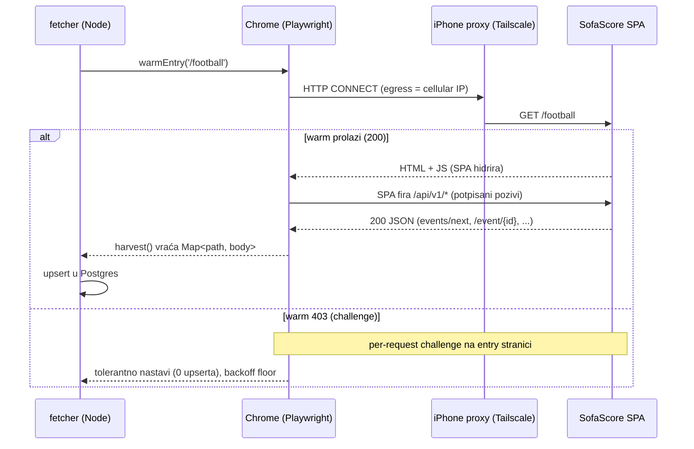
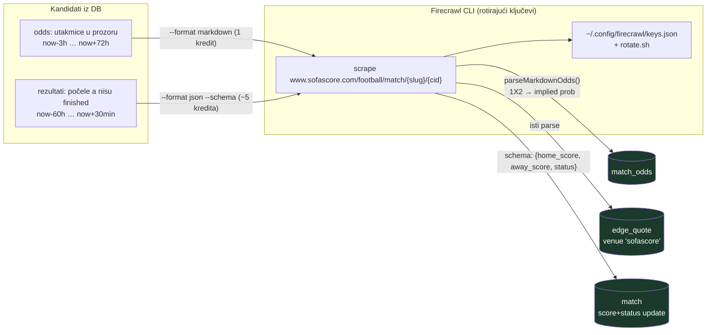
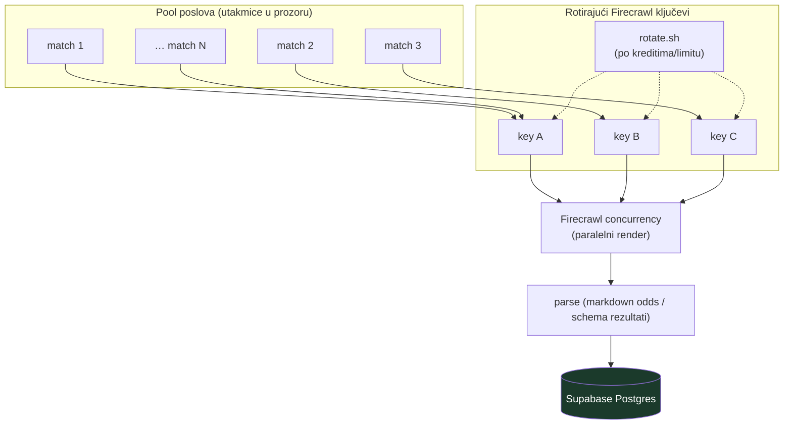
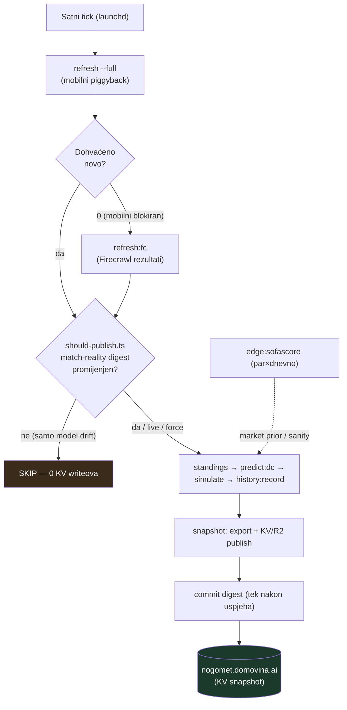

# 19 · Otporna multi-transport arhitektura dohvata (residential proxy + rotirajući Firecrawl)

Vizualni i tekstualni zapis fetching sustava izgrađenog do 2026-06-14: kako **kontinuirano**
i **bez blokiranja** dohvaćamo svježe SofaScore podatke (rezultati + koeficijenti) dok teku
utakmice, kombinirajući **residential/mobilni proxy** (piggyback) i **Firecrawl render**
(rotirajući API ključevi, paralelna skala). Trajni zapis svega naučenog.

Povezano: `docs/15` (challenge + piggyback), `docs/09/10` (egress, politeness), `docs/14`
(deploy/snapshot), `docs/16/18` (edge sloj). Memorije: `firecrawl-sofascore-transport`,
`mobile-proxy-piggyback-transport`, `kv-write-limit-drift-gate`, `sofascore-challenge-block-2026-06`.

---

## 1. Problem: SofaScore challenge je eskalirao

SofaScore nema službeni API; koristimo `api.sofascore.com/api/v1/...`. Kroz vrijeme obrana je rasla:



Ključni nalaz: **challenge je per-request potpis**, a ne čisti IP-ban. Direktni API pada
i kroz residential i kroz Firecrawl. Prolaze samo **SPA-ovi vlastiti pozivi** (mobilni
piggyback) ili **renderirana stranica** (Firecrawl).

---

## 2. Tri transporta — koji se kada koristi



| Transport | Egress | Što dohvaća | Trošak | Kad |
|-----------|--------|-------------|--------|-----|
| **Mobilni piggyback** | iPhone cellular (Tailscale) | raspored, rezultati, enrich | besplatno | primarni; svaki sat |
| **Firecrawl render** | Firecrawl rotirajuća infra | odds, rezultati | ~1–5 kredita/stranica | fallback kad mobilni padne / za odds |
| ~~Direktni API~~ | bilo koji | — | — | **mrtav (403)** |

---

## 3. Mobilni proxy piggyback (primarni put)



**Zašto pada (naučeno 2026-06-14):** Telemach cikla **mali pool IP-ova** (npr.
`.79.25 / .68.104 / .89.87 / .86.32`). Svaki *svjež* IP radi **~1 warm prozor**, pa ga
SofaScore re-challenge-a nakon aktivnosti. Airplane toggle često vrati **isti** IP. Robusnost
ugrađena u `politeness.ts`/`browser.ts`:

- **backoff floor**: challenge 403 šalje `Retry-After: 0`; `0 ?? fallback` je bio 0 → instant
  hamer + breaker u ms. Sad `Math.max(retryAfterMs, jitteredBackoff)`.
- **tolerantni warm**: 403 na entry stranici više ne ruši run — retry s backoffom pa nastavi.

---

## 4. Firecrawl render (fallback transport)

Direktni `api.sofascore.com` daje 403 i kroz Firecrawl. Ali **render match stranice radi** —
Firecrawlova infra izvrši SPA, a podaci slete u izlaz.



**Odds** — `npm run edge:sofascore` (`edge-sofascore-odds.ts`): markdown render → parser
featured booka (`[1\ … +1600] [X\ … +400] [2\ … -400]`; američki/decimalni/razlomački →
decimal → implied), piše u **oba** storea. Validirano: Haiti 5.6% / draw 18.9% / Scotland 75.6%.

**Rezultati** — `npm run refresh:fc` (`refresh-firecrawl.ts`): schema ekstrakcija (LLM čita
stranicu — robusnije jer layout varira) → ažurira samo score/status. `REFRESH_FC_DRY=1` za
dry-run. Validirano: Qatar 1-1 Switzerland, Brazil 1-1 Morocco, Haiti 0-1 Scotland.

> ⚠ Za **odds** je markdown-grep dovoljan (fiksni widget). Za **rezultate** koristi **schema
> ekstrakciju** — glavni score nije uvijek na vrhu rendera, grep bi bio krhak.

---

## 5. Vizija: paralelna skala + rotirajući Firecrawl ključevi

Firecrawl uklanja ovisnost o krhkom mobilnom IP-u: stranice se dohvaćaju **paralelno** kroz
njegovu infru, a **rotacija API ključeva** (`rotate.sh`) drži kredite/limite svježima. Time je
batch update moguć na skali bez blokiranja.



Trošak je kredit/stranica pa **nije za satni cron** na svemu — primjenjuje se ciljano (utakmice
u igri / blizu početka), dok mobilni piggyback ostaje jeftini primarni put kad prolazi.

---

## 6. Periodički update dok teku utakmice (puni lifecycle)



**KV write gate** (`docs` ovdje, memorija `kv-write-limit-drift-gate`): DC fit koristi
wall-clock time-decay (half-life 540d) → svaki sat λ/μ se mrve → ~50 serija shardova se
prepiše bez ikakve promjene rezultata → ~1200 KV writeova/dan > free limit 1000. Gate
digesta **samo match-reality** (score/status/raspored) → publisha samo na pravu promjenu;
mirni sati = **0 writeova**.

---

## 7. Naučene lekcije (sažetak znanja iz ovog ciklusa)

| # | Lekcija |
|---|---------|
| 1 | **Challenge je per-request potpis**, ne IP-ban. Direktni API mrtav i kroz residential i kroz Firecrawl. Prolaze SPA-pozivi (piggyback) ili render (Firecrawl). |
| 2 | **Mobilni IP pool je malen i flagira se** nakon aktivnosti; svaki svjež IP = ~1 warm prozor; airplane toggle često vrati isti IP. |
| 3 | **Firecrawl render zaobilazi challenge** — pouzdan fallback neovisan o IP-u. Odds = markdown (1 kr), rezultati = schema (5 kr, layout varira). |
| 4 | **KV free limit = 1000 writeova/dan**; time-decay drift ga je probijao. Gate na match-reality digest rješava (drift ≠ signal). |
| 5 | **harvestMatchView body-capture je nepouzdan** (`resp.json()` "body unavailable"); odds put `/event/{id}/odds/1/all` JE točan, ali render/body capture flakao — Firecrawl je zaobišao i to. |
| 6 | **Model je form-based bez opponent-strength** → apsurdi (Maroko>Brazil, Haiti>Škotska). Tržišne odds (sad u `edge_quote`/`match_odds`) = prior/sanity; rezultati potvrdili promašaje (Brazil 1-1 Morocco, Scotland 1-0 Haiti). |
| 7 | **politeness**: `Retry-After: 0` + `?? fallback` = instant hamer; backoff floor + tolerantni warm su nužni. |

---

## 8. Runbook (komande)

```bash
# Primarni (mobilni piggyback) — full sync + publish; gate odlučuje hoće li objaviti
cd fetcher && bash scripts/hourly-snapshot.sh         # launchd ovo vrti svaki sat

# Fallback rezultati kad mobilni vrati 0 (Firecrawl schema)
REFRESH_FC_DRY=1 npm run refresh:fc                   # dry-run (provjeri prije pisanja)
npm run refresh:fc                                    # primijeni score/status

# Odds (market prior) — par puta dnevno / blizu početka
SOFA_FC_MAX=14 npm run edge:sofascore                 # → match_odds + edge_quote

# Nakon ručnog refresh:fc/odds, recompute + objavi:
npm run standings && npm run predict:dc && npm run simulate && npm run history:record && npm run snapshot

# Provjera mobilnog egressa (živost proxyja)
curl -s -x http://100.71.146.11:8888 --max-time 12 https://api.ipify.org

# Firecrawl status (auth + krediti)
firecrawl --status
```

---

*Stanje na dan 2026-06-14: KV write gate, transport otpornost, Firecrawl odds (`edge:sofascore`)
i Firecrawl rezultati (`refresh:fc`) su na `main`. Remote nogomet.domovina.ai servira svježe
rezultate (Qatar 1-1, Brazil 1-1 Morocco, Haiti 0-1 Scotland) preko KV snapshota.*
